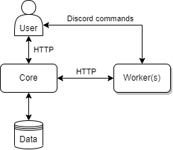
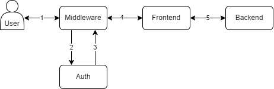

# Arquitectura

En este importante aspecto, la elección es clara, optándose por la arquitectura de microservicios.

En este tipo de proyecto un sistema monolítico no tiene sentido, ya que lo que se quiere evitar es crear un sistema compacto que incluya todas las características. Una arquitectura en capas, aunque es más versátil que la anterior, tampoco tiene mucho sentido. Tampoco lo tiene una arquitectura basada en eventos, ya que los eventos que se producirían son muy reducidos y la infraestructura necesaria no sería aprovechada. En este caso la funcionalidad se desarrolla centrándose en aspectos muy concretos y las ventajas de la arquitectura de microservicios superan a los inconvenientes.

Entre estas ventajas, destacaría en primer la modularidad, ya que el backend sería completamente independiente de la interfaz de usuario y de los workers. Esto permitiría por un lado el desarrollo de interfaces de usuario ilimitadas y por otro lado la posibilidad de escalar los *workers* sin tener que escalar el backend. Otras características son la escalabilidad (ya mencionada), la seguridad y el aislamiento, ya que cada microservicio del sistema no interfiere con los demás.

Las principales ventajas de los microservicios son:

- **Seguridad y aislamiento**. Cada uno de estos servicios encapsula su funcionalidad y características, quedando completamente aislados del resto. Cualquier tipo de brecha de seguridad se reduce a un sistema único, evitando la pérdida de información y la posible falla de otros microservicios.
- **Agilidad**. No es necesario desarrollar toda la funcionalidad completa, por lo que se pueden reutilizar otros microservicios ya desarrollados para cubrir las necesidades actuales.
- **Escalabilidad**. Debido a la modularidad de estos la escalabilidad horizontal es beneficiosa y asequible.
- **Modularidad**. Cada microservicio es independiente de otros, lo que facilita su desarrollo e implementación.

Sin embargo, esta arquitectura también tiene desventajas. La ejecución de una gran cantidad de servicios requiere costos extra de configuración e implementación más altos de lo habitual. Esto requiere una complejidad adicional porque, aunque los servicios son más ligeros y sencillos, crean un sistema mucho más complejo. La gestión también es más compleja ya que esta tarea requiere un conocimiento específico de cada microservicio.

Aún así, se opta por una arquitectura basada en microservicios compuesta por tres servicios distintos:

- **Backend**. Parte principal del sistema. Gestiona la creación de bots y comandos, y el despliegue de estos. Compuesto por un componente para la gestión de bots, otro para la gestión de comandos, otro de comunicación y finalmente otro de acceso a base de datos. La comunicación se divide en dos: con los workers y con los usuarios de la API REST.

  

- **Worker**. Ejecuta los bots. Un worker puede ejecutar N bots, y puede haber M workers distintos. Compuesto por un componente para la ejecución de bots y por otro de comunicación. Los workers se comunican directamente con el backend.

  

- **Frontend**. Interfaz de usuario. Se comunica con el backend mediante la API REST. Compuesto por un componente para la gestión de bots, otro para la gestión de comandos y por otro de comunicación.

  

## Autenticación y seguridad

Se ha decidido no incluir ningún sistema de autenticación en ninguno de los microservicios que lo conforma. Por lo tanto, podría decirse que el software es inseguro.

Implementar un sistema de autenticación implica la adición de una lógica extra que consume una serie de recursos, y puede ser algo que no sea necesario según dónde se implemente el sistema (e.g. una instalación local de pruebas). No implementando esta autenticación, se evita una implementación específica, que seguramente no case con los modelos usuales de autenticación.

Por otro lado, existen multitud de software y servicios que se dedican exclusivamente a la autenticación, y cuya integración con Matroos sería sencilla e incluiría esa capa de seguridad que falta. Algunos ejemplos son los siguientes:

- Auth0
- LDAP (con Traefik, NGinx u otros)
- OAuth2
- Firebase
- Amazon Cognito
- TLS (con un middleware)

## Posibles configuraciones

### Backend + workers + frontend

Sistema "completo" sin autenticación. El usuario accede a la configuración del sistema mediante el frontend y hace uso de los bots mediante los comandos en servidores de Discord.

### Backend + workers

Sistema sin autenticación ni frontend. El usuario accede a la configuración del sistema mediante la API REST que provee el backend y hace uso de los bots mediante los comandos en servidores de Discord.

### Autenticación externa + backend + workers + frontend

Sistema completo que cuenta con un middleware para la autenticación de usuarios. Todas las peticiones que realiza el usuario pasan por este middleware.

### Autenticación externa + backend + workers

Mismo caso que el anterior, pero sin intervención del frontend.

