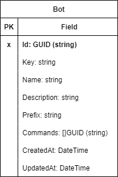
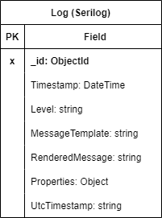

# Base de datos

En esta sección se definen las diferentes colecciones que se utilizan para almacenar los datos necesarios en Matroos.

## Colección "bots"

Almacena los bots creados por los usuarios.

## Colección "commands"

Almacena los comandos creados por los usuarios.

Referencias de tipos:

- [`CommandType`](./comandos.md#commandtype)
- [`CommandMode`](./comandos.md#commandmode)

## Colección "logs"

Almacena los mensajes de `log`. La estructura es definida por la librería `Serilog`.

